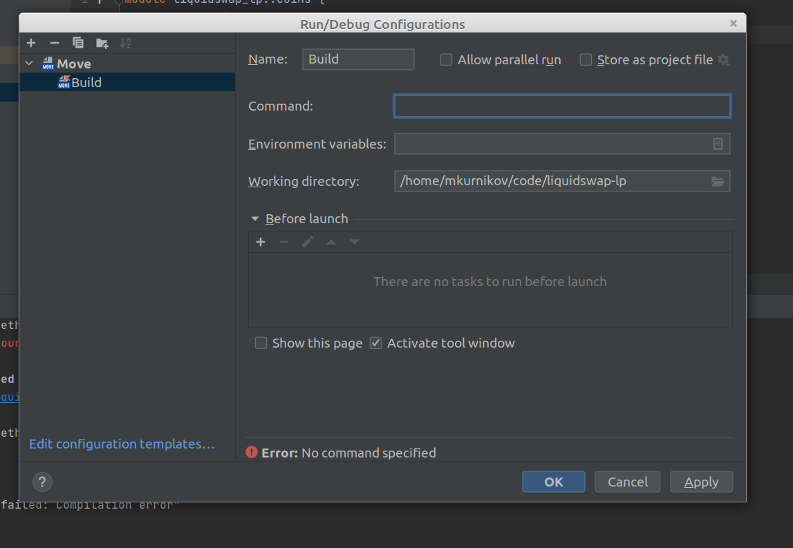
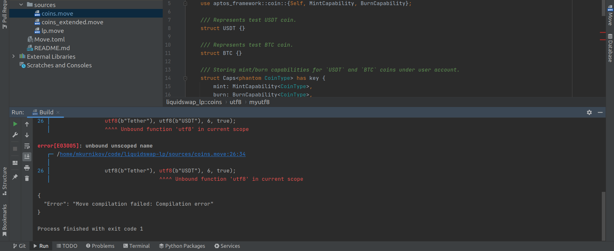

# INTELLIJ MOVE CHANGELOG: 1.19.0

5 Sep 2022

## New Features

* Add support for vector literals 
```move
let a = vector[1, 1];
```

* Add validation to Run Configurations.



* Add colored output support for `endless` command



## Fixes

* "Code -> Optimize Imports" action now correctly differentiate between names and types.

* Fix false-positive with import aliases in "Unused import" inspection. 

* Fix field shorthand pattern rename breaking the highlighting. 

* Fix renaming of function parameter usages in specifications.

## Internal

* Fix Gradle properties loading. 

* Update Gradle Intellij plugin, add `PluginConfigVerification` step to CI. 
