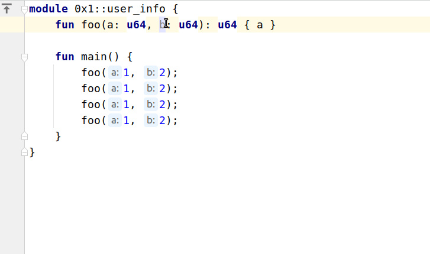
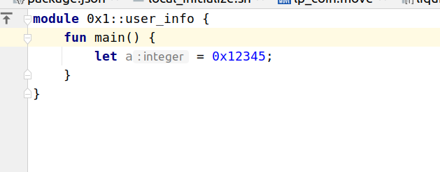

# INTELLIJ MOVE CHANGELOG: 1.20.0

27 Sep 2022

## New Features

* Remove parameter quickfix



* Highlight hex integer literals 



* Sort completion in borrow exprs.  

* Sort completions by abilities in type parameters.

* Support for imports inside code blocks. 
  
* Allow repeating function signature in spec for readability. 

* Type inference support for vector literals.

* Type check calls with not enough arguments.

* Type inference for statements in `loop {}` expr.

* Function test run configurations now created with module prefix, ie. 
```shell
endless move test --filter module_name::function_name
```

## Fixes

* Allow spaces inside `public(friend)` function modifier.

* Fix caching issue that lead to indeterministic type checking in some cases.

* Fix "unused parameter" error on native functions.

* Fix struct unpacking type inference. 
