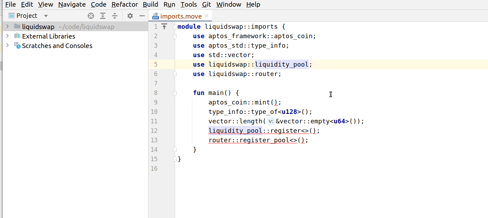
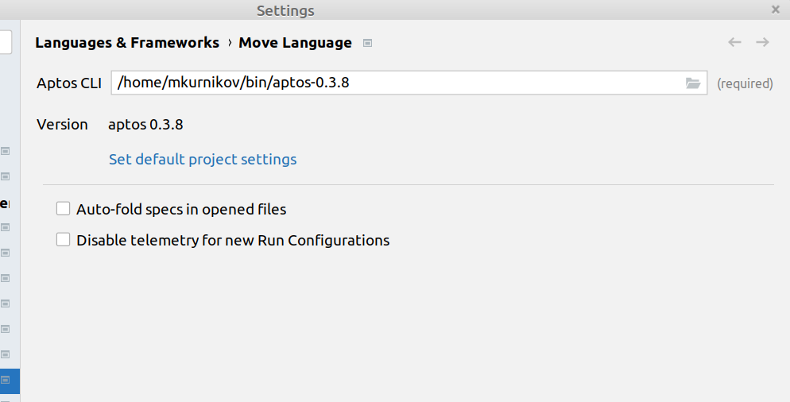

# INTELLIJ MOVE CHANGELOG: 1.21.0

18 Oct 2022

## New Features

* Support for local file system references in Move.toml file.
  
* Type checking for logic expressions.

* Optimize Imports: create fourth group of imports for Aptos libraries

* Auto-formatter: add automatic chopping down lists when exceeding maximum line length. 

* Add link to the default project settings in "Move Language" screen

* Allow diabling Aptos telemetry in all Run Configurations by default.

* Allow to execute tests for a file with one test module and multiple non-test modules.

* Add fields to symbols search. 

## Fixes

* Only create tests Run Configuration from root and from tests/ directory of the package.

## Internal

* Drop support for 2021.2 platform.

* Update Kotlin to 1.7.20. 
