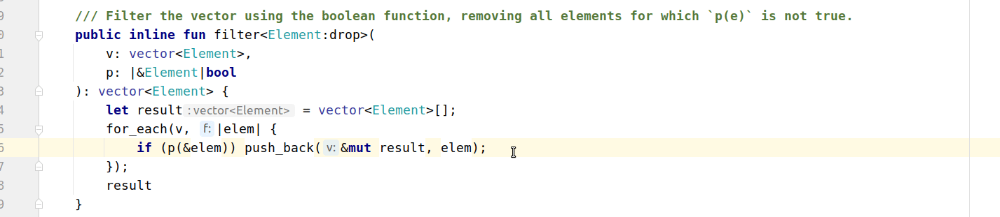

# INTELLIJ MOVE CHANGELOG: 1.26.0

TBD

## Features

* Name resolution for lambda declaration variables. 

* Support for type param bounds in function specs.
  
* Type / value parameter reference resolution in function specs.

* Better reference checking for lhs of the assignment statements.

## Performance

* Cache function body references resolution separately from the global namespace.
