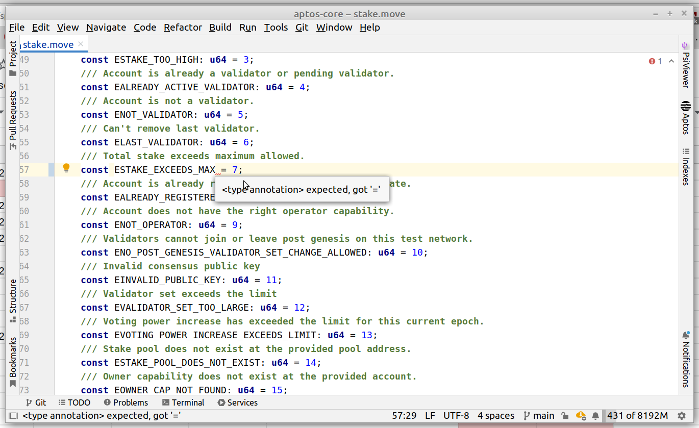
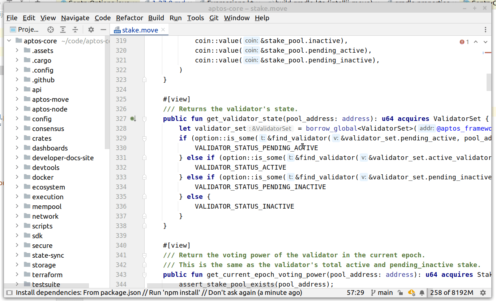

# INTELLIJ MOVE CHANGELOG: 1.27.0

16 Mar 2023

## Features

* Better suggestion for missing type annotation. 

* Add gutter icon to go to the function specification. 

* You can now report crashes happening in the plugin. When error occurres, select the blinking 
icon at the bottom of the page and click on "Report to Pontem Network". 

## Fixes

* Remove false-positives with `acquires` clauses in inline functions. [#97](https://github.com/pontem-network/intellij-move/issues/97)
