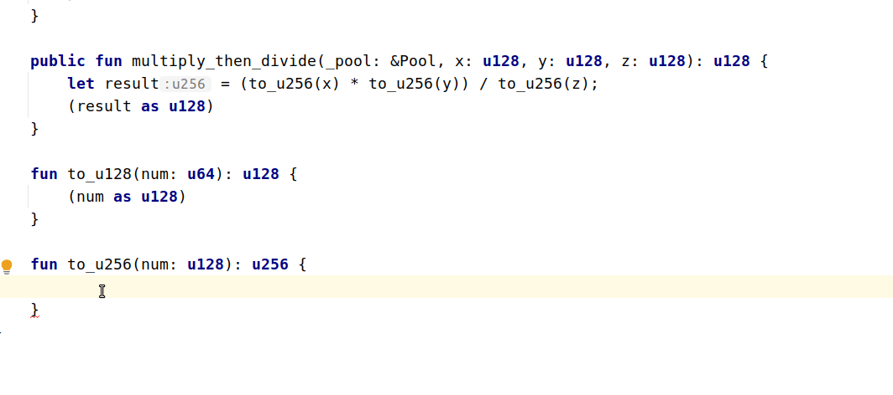

# INTELLIJ MOVE CHANGELOG: 1.27.1

TBD

## Features

* Check whether all cast expressions are wrapped with parentheses (with quickfix). 

## Fixes

* Properly resolve import aliases for some features of the plugin.

* Fix crash with let statement binding types.
