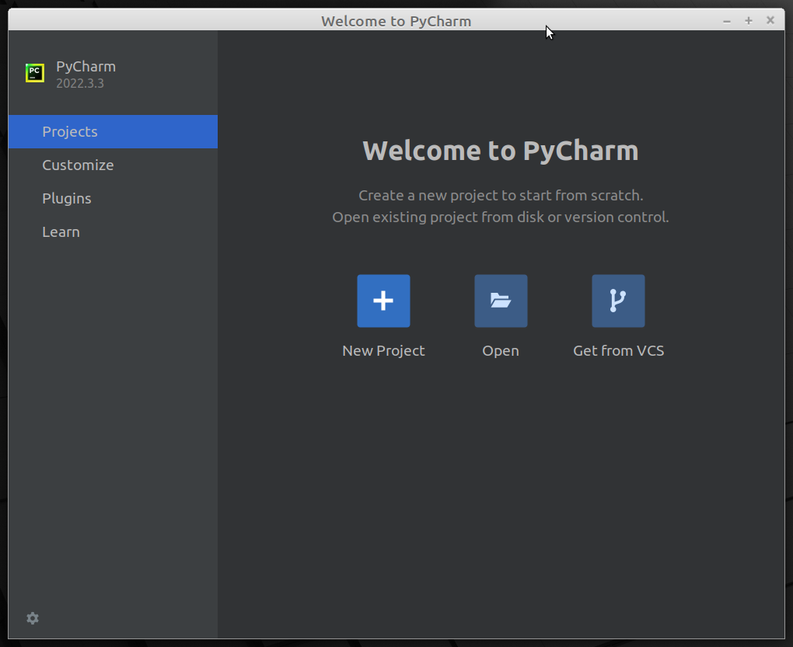
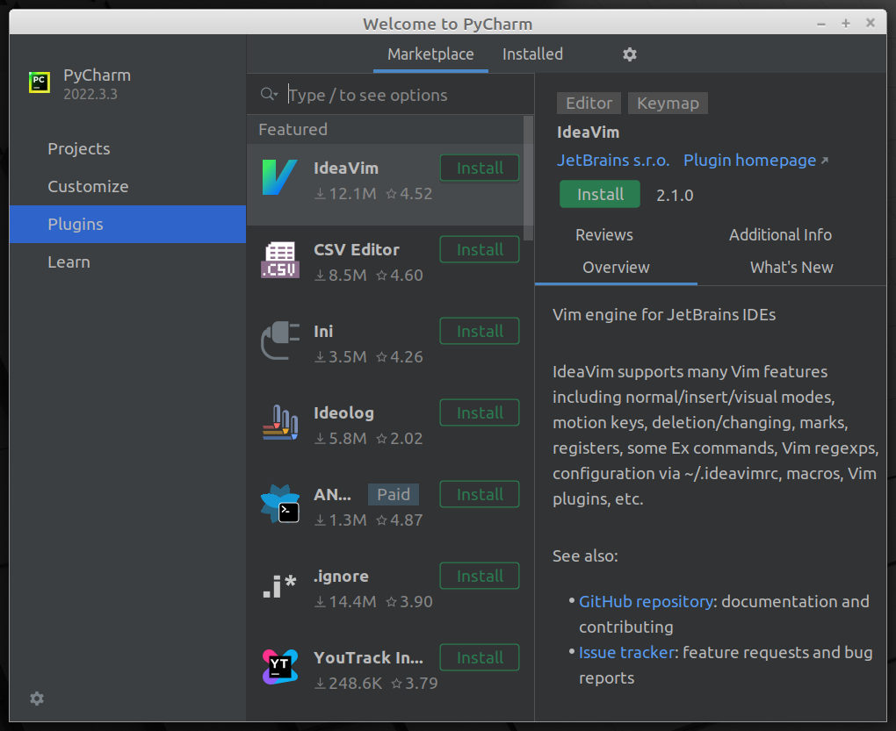
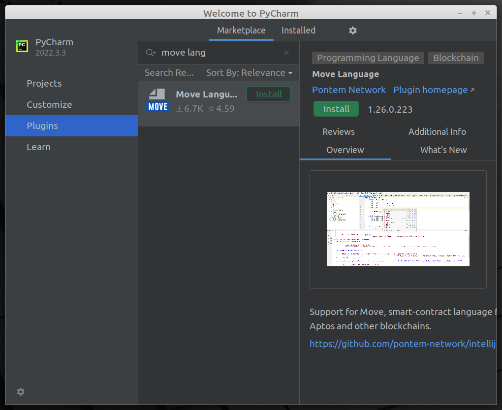

# How to install Move Language plugin

## 1. Download PyCharm / Intellij Community

If you haven't already, download either [PyCharm Community](https://www.jetbrains.com/pycharm/download/#section=windows) 
or [Intellij Community](https://www.jetbrains.com/idea/download/#section=windows) from JetBrains website. 
You don't need a license for those. Other JetBrains products like WebStorm or CLion are okay too. 

Move Language plugin works with 2022.1+ versions of those products. 

## 2.1. Install Move Language plugin from fresh IDE

If this is the first time you've started IDE, you'll see the welcome screen: 

To install the plugin, select the `Plugins` link from the menu on the left:

If you've been using the IDE previously, choose `File` menu at the top of the window, 
and click `Settings...` (or press `Ctrl+Alt+S`). Then select `Plugins` section on the left. 

Search for "move lang" and click `Install`: 

