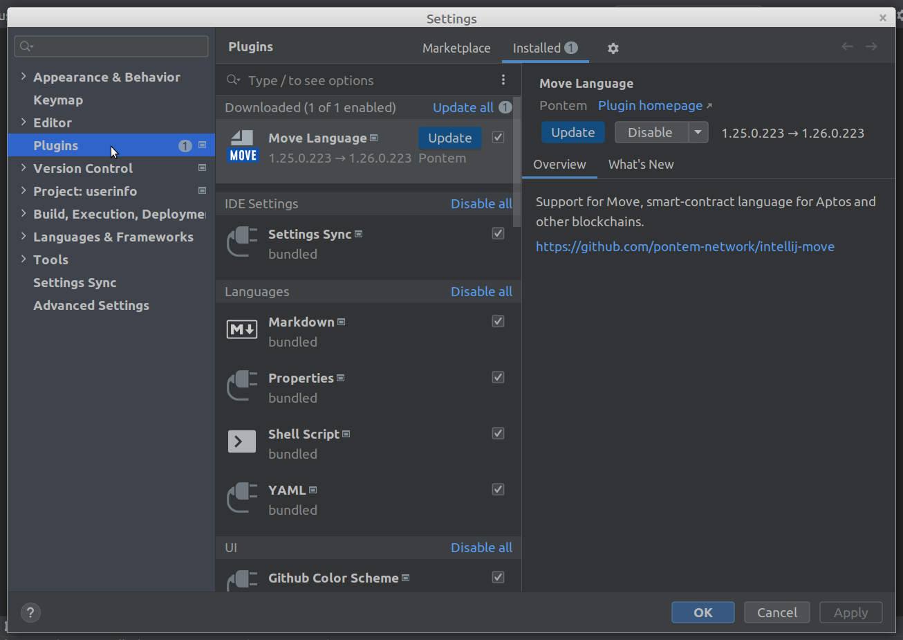

# How to update Move Language plugin to a new version

From the Main Menu on the top, open settings at `File` -> `Settings...` (or press `Ctrl+Alt+S` / `⌘ ,`). 
Then select the `Plugins` section from the left sections list.

Click on the `Update` button to download and install the new version of the plugin.
